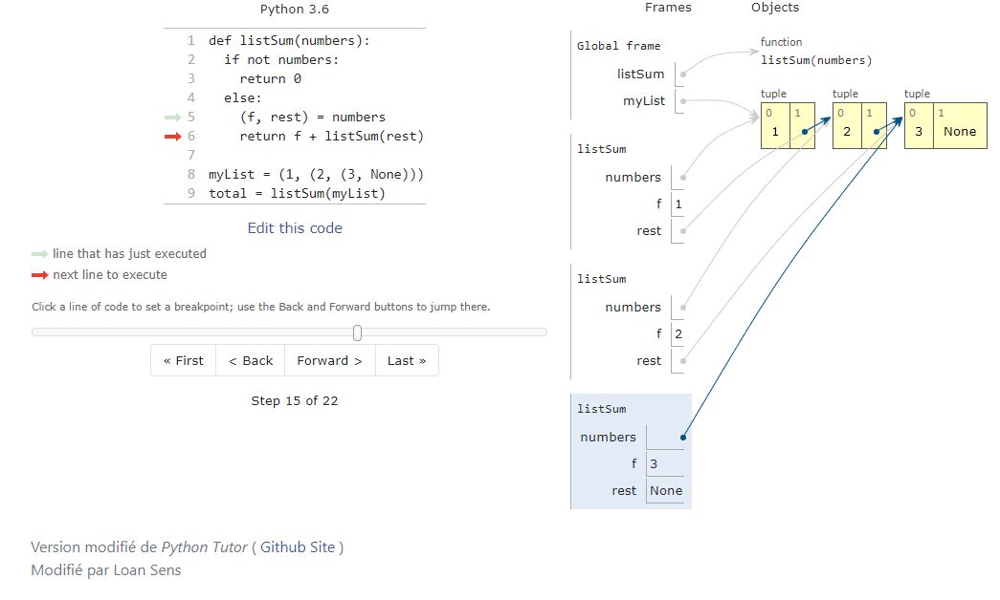

# PythonTutor (version simplifiée)

Permet d'éditer du code Python en ligne  tout en visualisant de manière très exacte l'éxécution pas à pas du programme.



## Quick start 
```sh
pip install bottle # make sure the bottle webserver (http://bottlepy.org/) is installed
cd PythonTutorMod
python bottle_server.py
```

Après cela le site sera disponible à l'adresse local :
[http://localhost:8003/visualize.html](http://localhost:8003/visualize.html)

### Source


Je me suis contenté de modifier l'orginal pour concentrer sur Python et enlever les fichiers inutiles que propose le site web. J'ai aussi amélioré un peu le style.
[https://github.com/pgbovine/OnlinePythonTutor](https://github.com/pgbovine/OnlinePythonTutor)